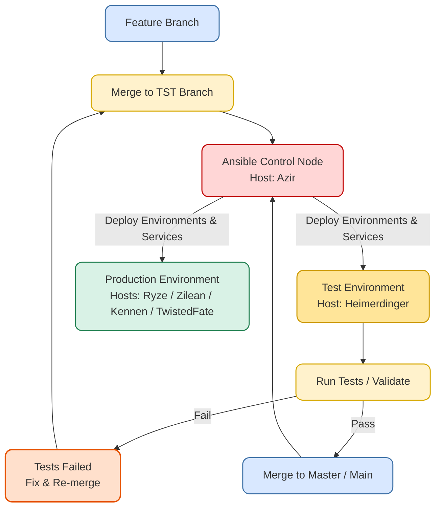
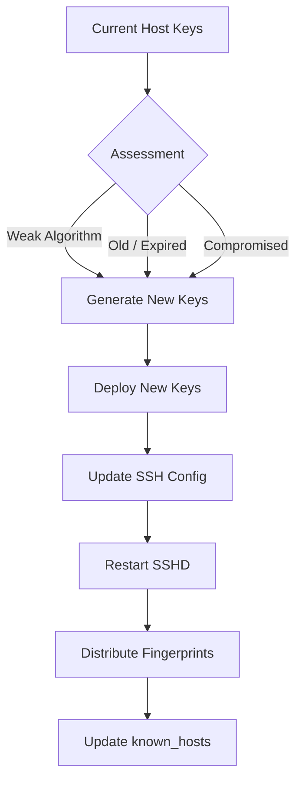

# Ansible Homelab Config

```mermaid
flowchart
    %% ----------------- Git & Branching -----------------
    GIT["Feature Branch"]:::git
    TST_BRANCH["Merge to TST Branch"]:::pipeline
    TEST["Run Tests / Validate"]:::pipeline
    FAIL["Tests Failed\nFix & Re-merge"]:::fail
    MAIN["Merge to Master / Main"]:::git

    %% ----------------- Ansible Node -----------------
    ANS["Ansible Control Node\nHost: Azir"]:::ansible

    %% ----------------- Environments -----------------
    TST_ENV["Test Environment\nHost: Heimerdinger"]:::tst
    PROD_ENV["Production Environment\nHosts: Ryze / Zilean / Kennen / TwistedFate"]:::prod

    %% ----------------- Workflow -----------------
    GIT --> TST_BRANCH
    TST_BRANCH --> ANS
    ANS -->|Deploy Environments & Services| TST_ENV
    TST_ENV --> TEST
    TEST -- Fail --> FAIL
    FAIL --> TST_BRANCH
    TEST -- Pass --> MAIN
    MAIN --> ANS
    ANS -->|Deploy Environments & Services| PROD_ENV

    %% ----------------- Styles -----------------
    classDef git fill:#d9e8ff,stroke:#3a6ea5,stroke-width:1.5px,rx:10,ry:10;
    classDef pipeline fill:#fff2cc,stroke:#d6a800,stroke-width:1.5px,rx:10,ry:10;
    classDef tst fill:#ffe599,stroke:#cc9900,stroke-width:1.5px,rx:10,ry:10;
    classDef prod fill:#d9f2e6,stroke:#1e7f4f,stroke-width:1.5px,rx:10,ry:10;
    classDef ansible fill:#ffd6d6,stroke:#c00000,stroke-width:1.5px,rx:10,ry:10;
    classDef fail fill:#ffe0cc,stroke:#e65100,stroke-width:2px,rx:10,ry:10;
```

```mermaid
flowchart TD
    A[Current Host Keys] --> B{Assessment}
    B -->|Weak Algorithm| C[Generate New Keys]
    B -->|Old / Expired| C
    B -->|Compromised| C
    C --> D[Deploy New Keys]
    D --> E[Update SSH Config]
    E --> F[Restart SSHD]
    F --> G[Distribute Fingerprints]
    G --> H[Update known_hosts]
```
